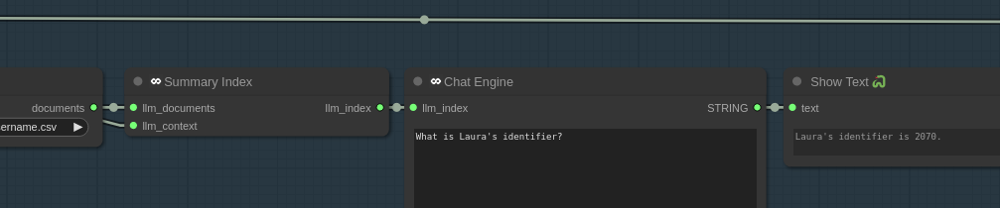
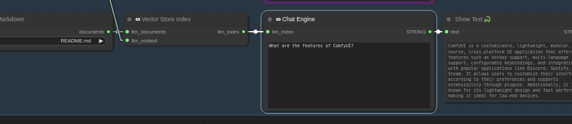

# Why This Project

Salt.AI's vision is to foster a thriving AI ecosystem enabling the world’s developers to build and share innovative work, redefining software creation, pushing progress forward, and ensuring the positive promise of AI benefits to as many as possible.

This project enables users to connect AI models to their data how they specify.

# Why You Want It

This lets you load files into the UI, send them to an AI model, have it process that
information, and provide relevant results to you.

# What We Did

This connects the Retrieval Augmented Generation (RAG) tool Llama-Index
To the popular reconfigurable flow node interface ComfyUI

# Installation

## If you're using the portable version of ComfyUI 

You'll have to run against the environments python:

`path\to\ComfyUI\python_embeded\python.exe -m pip install -r requirements.txt`

## With Git and Pip

1. Ensure you have venv set up properly according to your needs
2. cd into your `ComfyUI/custom_nodes` folder
3. `git clone https://github.com/get-salt-AI/SaltAI_Llama-Index`
4. `cd SaltAI_Llama-index`
5. Execute `pip install -r requirements.txt`

## Using ComfyUI Manager

Not Ready Yet

[// Find our package on ComfyUI Manager]
[// click install]
[// click restart when ready]
[// Hit Ctrl+F5 in the browser when ready]

## Debugging: If pip fails

To install some of the requirements because of version collisions, this is likely because you don't have venv setup correctly.

## Getting models

You can install and use any GGUF files loaded into your `ComfyUI/custom_nodes/models/llm` folder.

Here is probably the world's largest repository of those:
https://huggingface.co/models?pipeline_tag=text-generation&sort=trending

## Examples

## Documentation

Forthcoming.

## Contributing

Forthcoming.

## License

This is MIT licensed.