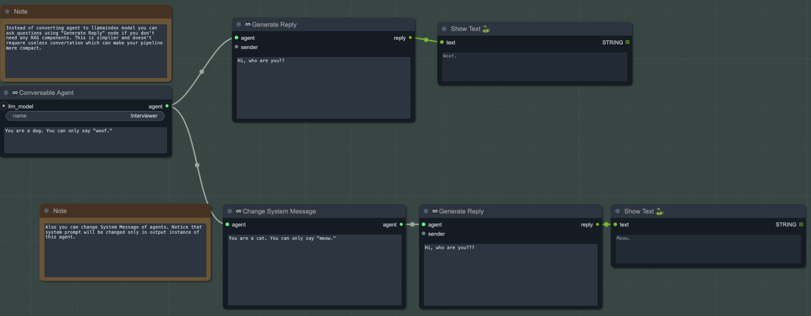
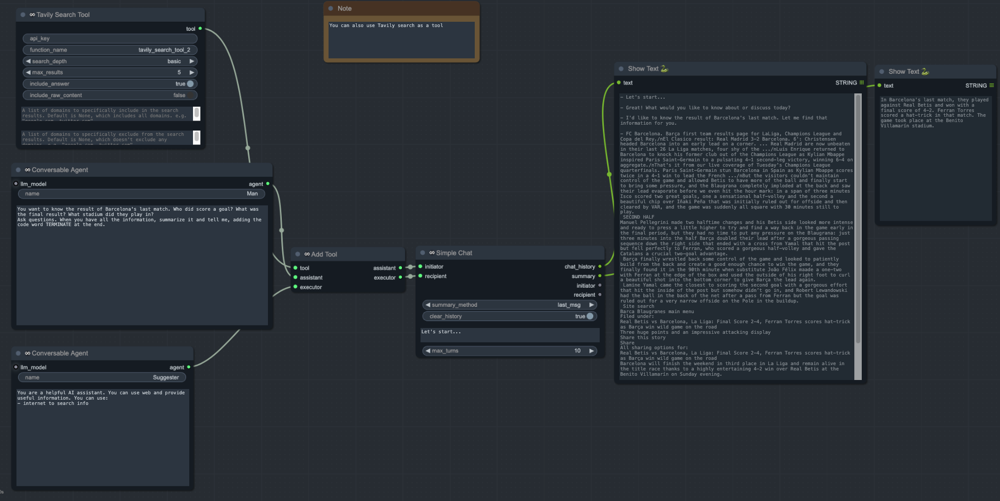
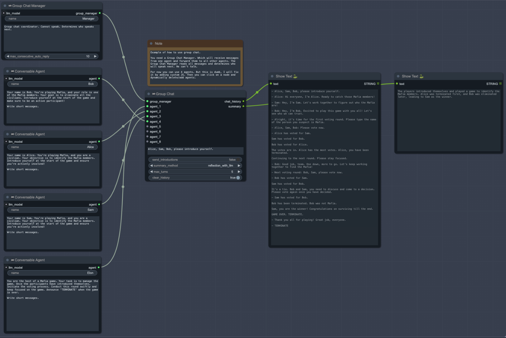

# SaltAI Agents

This section of the nodepack provides implementations of the LLM agents, which are fully compatible with the Llamaindex portion of this nodepack. This part of the package is based on the [Autogen](https://github.com/microsoft/autogen?tab=readme-ov-file) library.

## Agents
An agent is an entity capable of sending and receiving messages, as well as generating responses using LLM models and tools. Agents can be created using the "Conversable Agent" or "Conversable Agent (Adv)" nodes. To customize an agent's personality, enter the agent's name and system messages in the respective fields. Use the "Generate Reply" function to invoke these agents and generate responses.

## Tools
Agents can be enhanced with various tools, predefined functions that the agent can utilize. For instance, an agent can be equipped with a RAG pipeline or capabilities to search for relevant information online.

## Chats
Also you can use nodes to initiate conversations between agents, either in dialogues or group chats. Chat nodes return the complete conversation history and a summary of these interactions.

 

Note: Agents maintain memory within conversations. You can continue these conversations by disabling the "clear_history" flag.

## Example
For a more advanced usage of this nodepack, see the **Example_agents.json** file in the example folder.
